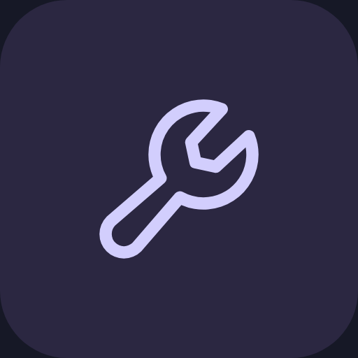
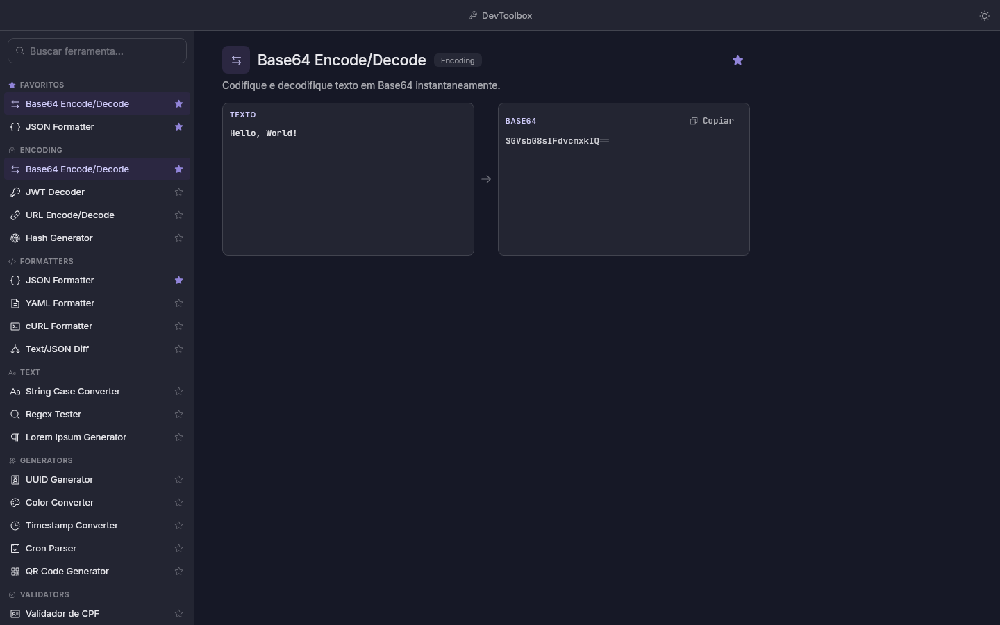
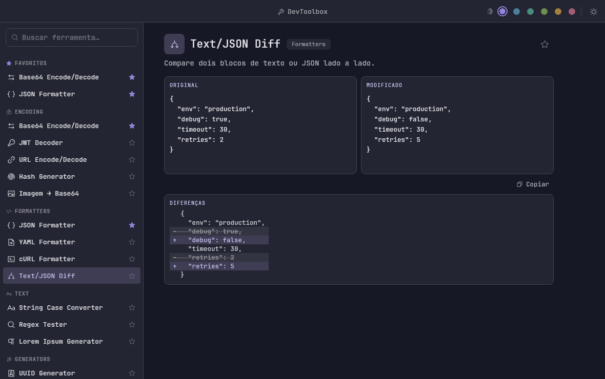
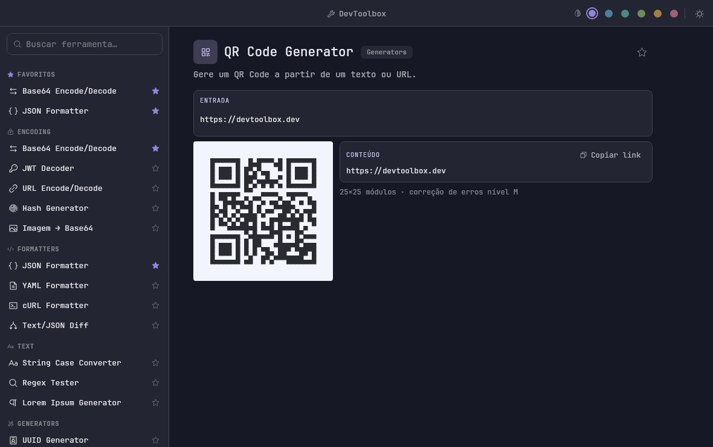
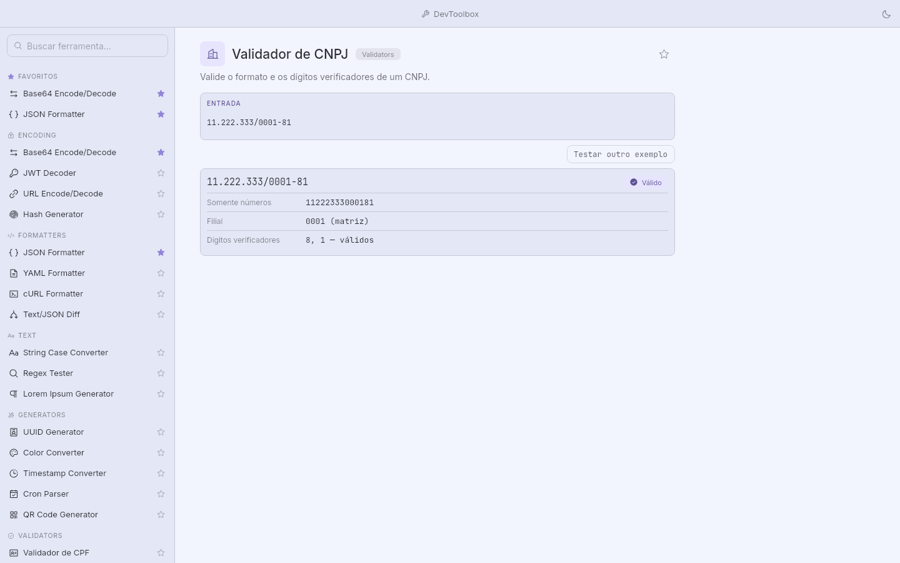

<div align="center">



# DevToolbox

**23 ferramentas de desenvolvimento em um app desktop. Offline, instantâneo, sem telemetria.**

[](https://github.com/lucascosta95/devtoolbox/actions/workflows/build.yml)




</div>

---

## Por que existe

Você abre um site aleatório para decodificar um JWT, outro para formatar JSON, um terceiro para
validar um CPF — e cola dados de trabalho em servidores que não conhece.

O DevToolbox faz tudo isso **na sua máquina**. Nenhuma ferramenta acessa a rede, nada é enviado
para lugar nenhum, e as entradas que você digita nunca são gravadas em disco.

## As ferramentas

| Categoria | Ferramentas | |
|---|---|---|
| **Encoding** | Base64 · JWT Decoder · URL Encode/Decode · Hash (MD5/SHA-1/SHA-256) · Imagem → Base64 | 5 |
| **Formatters** | JSON · YAML · cURL · SQL · NRQL · Diff de texto e JSON | 6 |
| **Text** | String Case (8 formatos) · Regex Tester · Lorem Ipsum | 3 |
| **Generators** | UUID v4 · Cores (HEX/RGB/HSL/OKLCH) · Timestamp · Cron · QR Code | 5 |
| **Validators** | CPF · CNPJ · Telefone brasileiro · Cartão de crédito (Luhn) | 4 |

Tudo processa **entrada real**, com recálculo enquanto você digita e erro explicando o que está
errado — não só "inválido":

> `JSON inválido na linha 3, coluna 12: esperava ':' após a chave "b"`

<div align="center">


</div>

## Instalação

Baixe o instalador da sua plataforma em **[Releases](https://github.com/lucascosta95/devtoolbox/releases)**:

| Plataforma | Arquivo | Observação |
|---|---|---|
| Linux | `.deb` | `sudo apt install ./devtoolbox_*.deb` |
| Windows | `.msi` | O SmartScreen avisa na primeira execução (não assinado) |
| macOS | `.dmg` | Ajustes → Privacidade e Segurança → "Abrir mesmo assim" |

Todos trazem a JVM embutida — **não é preciso ter Java instalado**.

## Atalhos

| | |
|---|---|
| `Ctrl/Cmd` + `K` ou `F` | Foca a busca |
| `↑` `↓` | Navega a lista filtrada |
| `Esc` | Limpa a busca |
| `Ctrl/Cmd` + `D` | Favorita a ferramenta ativa |
| `Ctrl/Cmd` + `Shift` + `L` | Alterna claro/escuro |

Favoritos, recentes, tema, cor de destaque e última ferramenta aberta são lembrados entre execuções
(`~/.config/devtoolbox` no Linux, `Application Support` no macOS, `%APPDATA%` no Windows).

<div align="center">

</div>

## Arquitetura

Três módulos, com uma regra que sustenta o resto: **`:core-tools` não conhece a UI**.

```
:core-tools     lógica pura em commonMain — sem Compose, sem I/O, sem rede
    ↑
:designsystem   tokens Nocturne, componentes e os 9 arquétipos de layout
    ↑
:app-desktop    janela, empacotamento, ícones
```

Cada ferramenta implementa um contrato de uma função só:

```kotlin
interface Tool {
    val id: String
    val name: String
    val category: Category
    val defaultInput: ToolInput

    fun run(input: ToolInput): ToolOutput   // puro e síncrono
}
```

Como `run` é puro, cada ferramenta é testável sem UI, sem relógio e sem mock. E como a saída é
um **descritor de layout** (`ToolBody.Io`, `.Rows`, `.Diff`, `.Validate`…), a interface já sabe
desenhar qualquer ferramenta nova sem uma linha de código de UI.

**Adicionar uma ferramenta:** uma classe, uma linha no `ToolRegistry`, um teste.

### Zero dependências no core

`:core-tools` não tem nenhuma dependência de runtime. MD5, SHA-1, SHA-256, Base64,
percent-encoding, JSON, um subset de YAML, cron, conversão OKLCH, o algoritmo de Luhn, a leitura
de cabeçalho de imagem e o encoder de QR Code são implementados no projeto — em `commonMain`,
prontos para Android, iOS ou Wasm sem mudar uma linha.

## Desenvolvimento

```bash
./gradlew :app-desktop:run          # roda o app
./gradlew test                      # 253 testes
./gradlew :app-desktop:screenshot   # renderiza cada tela em PNG, sem abrir display
./gradlew :app-desktop:packageDeb   # instalador da plataforma atual
```

Requer **JDK 21**. O Gradle vem pelo wrapper.

`screenshot` renderiza a UI headless via `ImageComposeScene` — uma imagem por ferramenta, mais
os estados de busca e erro. É o que permite revisar mudanças visuais sem abrir a janela.

Os ícones (`.png`, `.ico`, `.icns`) são gerados a partir dos tokens do design system pela tarefa
`appIcon`, da qual o empacotamento depende — por isso não são versionados.

### Testes

Cada transformação e cada validador têm teste, sempre incluindo entradas inválidas:

- hashes conferidos contra os vetores oficiais da RFC 1321 e do FIPS 180
- QR Code cruzado com a **ZXing** (só no classpath de teste — o core segue sem dependências)
- cor com round-trip HEX ↔ RGB ↔ HSL ↔ OKLCH
- CPF/CNPJ com dígitos verificadores recalculados por implementação independente no teste
- cartão de crédito com os números de teste públicos das bandeiras (Luhn)
- imagem com round-trip encode/decode e detecção de formato por magic bytes

## CI

`.github/workflows/build.yml` roda em push para `main`, em pull request e sob demanda:

1. **testes** no Ubuntu, publicando os relatórios como artefato quando falham
2. **instaladores** em matriz `ubuntu` / `windows` / `macos`, gerando `.deb`, `.msi` e `.dmg`
3. **release** apenas em tag `v*`, juntando os três instaladores

```bash
git tag v1.3.0 && git push origin v1.3.0
```

## Limitações conhecidas

- **JWT** decodifica header e payload, mas **não verifica a assinatura**
- **YAML** cobre um subset: mapas e sequências em bloco e flow, escalares simples e comentários.
  Âncoras, múltiplos documentos, tags e escalares em bloco são recusados com erro explícito
- **Cron** aceita 5 campos com `*`, número, intervalo, passo e lista — sem `L`, `W`, `#` ou `@daily`
- **QR Code** em modo byte, correção nível M, versões 1–10 (até 213 bytes)
- **Imagem → Base64** aceita até 5 MB, em PNG, JPG, GIF, WebP, BMP, ICO e SVG
- Os instaladores **não são assinados**

## Créditos

Ícones [Phosphor](https://phosphoricons.com) · tipografia
[JetBrains Mono](https://www.jetbrains.com/lp/mono/) (OFL) · design system Nocturne.

## Licença

MIT
